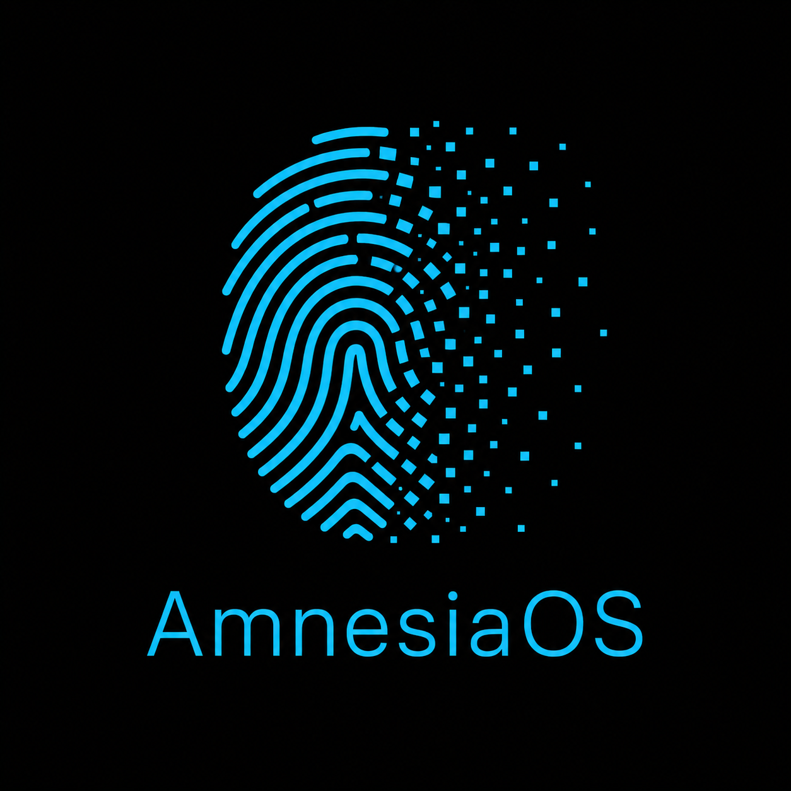

# AmnesiaOS

  

<h1 align="center">AmnesiaOS</h1>
> A minimal Linux operating system that boots entirely into RAM, leaving no trace on shutdown.

## What is AmnesiaOS?

AmnesiaOS is a custom Linux distribution built from scratch using Linux From Scratch (LFS) methodology. The entire operating system loads into RAM at boot time — when you shut down, nothing remains on the storage device.

## Features

- **Full RAM execution** — the OS runs entirely in memory
- **No disk traces** — shutdown leaves no forensic footprint
- **Minimal footprint** — lightweight initramfs-based system
- **Custom kernel** — Linux 6.16.1 compiled from source
- **Built from scratch** — no existing distro base

## System Requirements

- x86_64 processor
- 512MB RAM minimum (1GB recommended)
- USB drive or bootable media

## Quick Start

1. Download the latest ISO from [Releases](../../releases)
2. Flash to USB: `dd if=amnesia-os.iso of=/dev/sdX bs=4M status=progress`
3. Boot from USB
4. The system loads entirely into RAM

## Build from Source

See [docs/build.md](docs/build.md) for full build instructions.

## Architecture

See [docs/architecture.md](docs/architecture.md) for how RAM boot works.

## License

GPL-3.0 — see [LICENSE](LICENSE)
